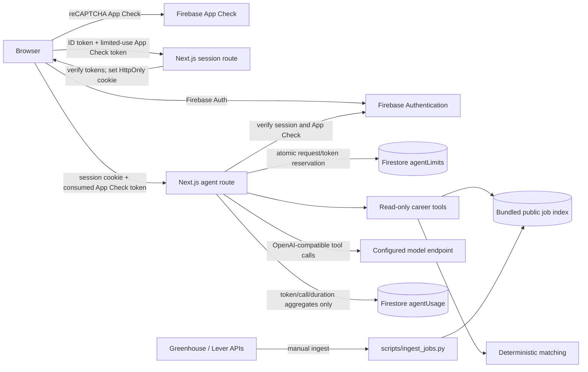

# Workfinder Architecture

## Scope

Workfinder is a Next.js career research application with Firebase Authentication, Firebase App Check, and Firestore-backed per-user agent quotas/usage telemetry. User profile preferences, saved roles, and relevance feedback remain in browser storage under a Firebase UID namespace; they are sent to the configured model endpoint only for an agent request and are not synced between devices.

The agent researches public listings, explains deterministic matches, identifies possible skill gaps, and prepares interview practice. It cannot apply, message, contact recruiters, access accounts/devices, or run arbitrary code.

## System

## Request Flow

1. Email/password sign-in happens with Firebase Auth. Sign-up sends a verification email; unverified accounts cannot create a Workfinder session.
2. The browser exchanges a verified Firebase ID token and limited-use App Check token with `/api/auth/session`. The server verifies both, checks revocation, then sets a five-day HttpOnly, SameSite=Lax cookie. Production uses the `__Host-` prefix and Secure attribute.
3. The agent route validates the exact Origin and body limit, verifies the session cookie and consumes a fresh App Check token, then reserves per-user minute/day requests and tokens inside a Firestore transaction.
4. The server sends the model the current request context and only four declared read-only tools. It records aggregate token and latency metrics in Firestore without storing prompts, profile context, or answers.
5. If metering fails, the route fails closed rather than returning an unmetered successful response. Model failures settle the reservation and record a failed request when Firestore is available.

## Components

- **Next.js App Router:** UI and same-origin session/agent routes. Production binds to loopback by default.
- **Firebase Auth:** email/password accounts, verification email, password reset, ID-token verification, five-day server session cookies, and revocation checks.
- **Firebase App Check:** reCAPTCHA v3 client attestation. The browser requests limited-use tokens; the Admin SDK consumes each token to reject replay.
- **Cloud Firestore:** server-only atomic quotas in `agentLimits/{uid}` and token aggregates in `agentUsage/{uid}/days/{UTC-date}`. `firestore.rules` denies all direct client access. Admin access is gated by verified session/App Check on each API route.
- **Public job data:** normalized JSON seed/export. The Python standard-library importer adds public Greenhouse and Lever listings; ingestion is manual.
- **Matcher and agent:** deterministic role/skill/location score plus a model-assisted, bounded tool loop. The configured OpenAI-compatible endpoint and credential remain server-side.
- **Browser workspace:** preferences, saved role IDs, and relevant/irrelevant feedback are locally persisted and namespaced by Firebase UID. They are not stored in Firestore or synced across devices.

## Decisions

### Firebase for identity and abuse controls

The request explicitly selects Firebase. Firebase's Auth/App Check/Firestore services are managed Google services, not self-hostable open-source software; the client/Admin SDKs are Apache-2.0. Firebase is not a no-cost guarantee: quotas, App Check verification, Firestore operations, and model inference have plan/provider limits and may require billing. Review the project's current pricing and set budget alerts.

### HttpOnly session cookie, not browser bearer tokens

Firebase ID tokens are exchanged once for a five-day HttpOnly cookie. The client signs out of the Firebase Auth SDK after exchange so it does not keep a long-lived ID token in local storage. Mutating session endpoints also require same-origin requests. Session cookies are checked for revocation on protected agent calls.

### App Check replay protection

Each auth exchange and agent request gets a limited-use reCAPTCHA App Check token. The Admin SDK consumes it server-side. This supplements identity and Origin checks; App Check is abuse resistance, not user authentication.

### Transactional per-user quotas

Firestore transactions enforce 6 agent requests per user per minute, 40 per user per UTC day, and a 180,000-token per-user daily budget reserved in 32,000-token blocks by default. A second shared ledger caps all accounts at 120 requests/minute, 200 requests/day, and 1,000,000 reserved tokens/day by default. Environment variables can tune these values. Token quotas are not a monetary provider-spend ceiling; model pricing differs. The shared ledger serializes reservations and is intended for modest traffic; use dedicated distributed rate limiting and provider spend controls for internet-scale exposure.

### Privacy-minimized telemetry

Daily Firestore aggregates include input/output/total tokens, completion/tool calls, duration, model, request/failure counts, and an `expiresAt` 90 days in the future. No prompts, answers, job descriptions, API keys, or IP addresses are logged or written to telemetry. Enable a TTL policy on the `days` collection group for automatic cleanup; TTL behavior and billing depend on the Firebase plan.

### Deterministic scores and read-only model tools

Application code owns ranking and score calculation. The model only synthesizes explanations and interview practice using `search_jobs`, `explain_match`, `compare_jobs`, and `interview_prep`. Job descriptions are untrusted data. No write or external-action tool is registered.

## Security Controls

- Firebase Admin initializes from Application Default Credentials and a server-only project ID. No service-account JSON or model key is committed or sent to client code.
- Agent requests require a verified email, non-revoked session, consumed App Check token, same-origin request, bounded JSON body, bounded conversation, tool-call ceiling, provider timeout, and Firestore quota reservation.
- Firestore client rules deny all reads/writes. Admin SDK bypasses rules, so API identity verification is mandatory.
- Standard browser security headers are set by Next.js. TLS, HSTS, and any public ingress authentication/rate limiting belong at the reverse proxy/load balancer.
- Rate/usage storage fails closed. Provider/model failures are returned without exposing SDK details; logs contain only random request IDs and event names.

## Operations and Boundaries

- `NEXT_PUBLIC_FIREBASE_*` values identify the web app and are public; Admin credentials and model credentials are server-only.
- Add localhost and production domains to Firebase Auth's authorized domains and App Check's reCAPTCHA configuration.
- The server environment needs ADC with Auth, App Check verification, and Firestore permissions. Use workload identity/attached service identity in hosting; use an ignored service-account file for local development.
- Define a Firestore TTL policy for `agentUsage/{uid}/days/*` using `expiresAt` if automatic 90-day deletion is required.
- Ingest jobs intentionally before building; the app uses the JSON snapshot and has no scheduler.
- Preferences, saved jobs, and feedback remain local and per-browser even after sign-in. Cross-device sync and server-side profile persistence are not implemented yet.
